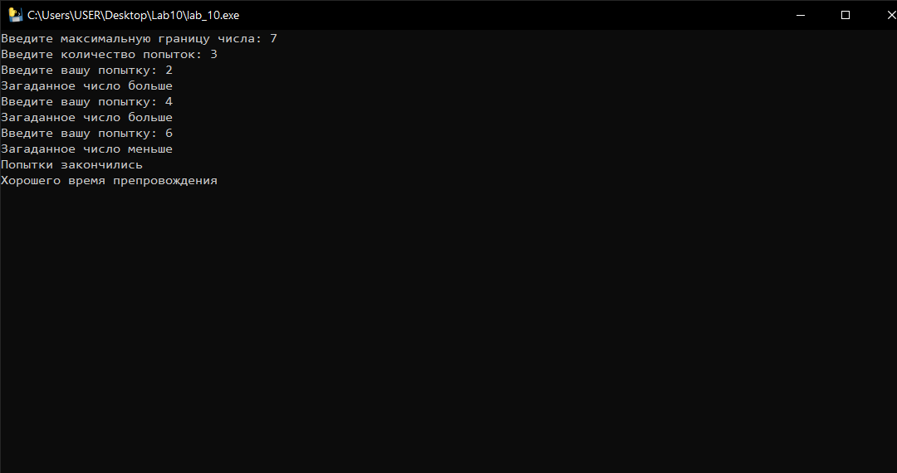
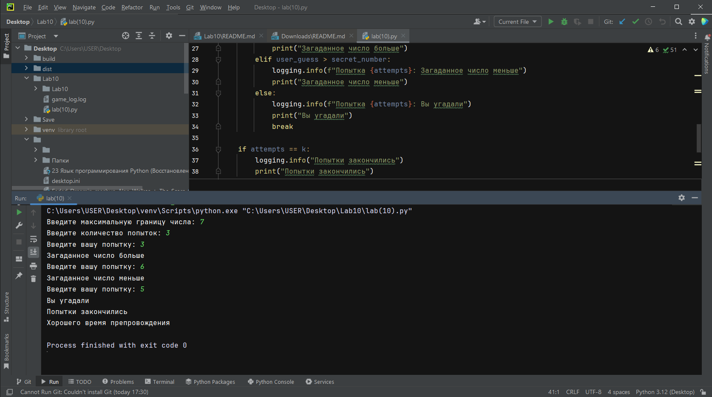
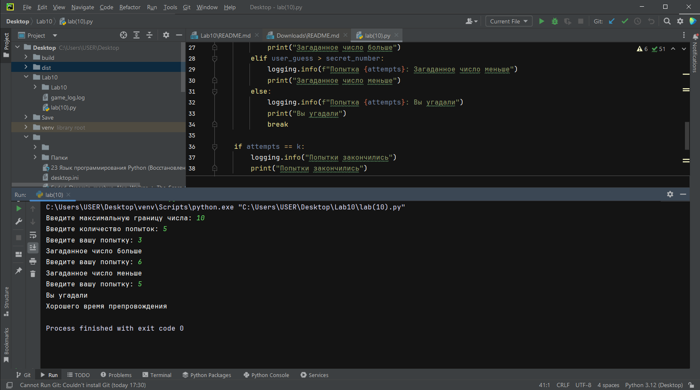

___
# Lab10
 Лабораторная работа №10 по Прикладному Програмированию
___
# Исполнитель
Студент: Федоров Даниил Сергеевич

Группы: Фт-220007

___
# Описанние
Язык программирования: Pynton 3.12.0

Данный репозиторий содержит две программы: 

 1. lab_10.exe - испольнительный файл программы который вызывает 
консоль, в которой пользователю предоставляется ввод максимального
предел чисел в которых тот может работать, после количество попыток
и игра начинается, ваша цель найти загаданое программой число в лимит ваших попыток,
программа вам поможет подсказкой, меньше или больше в зависимости от вашего числа.

 2. lab10.py - код программы описанной выше.

Открыть программу можно на любой ОС, а прилижающий код в любом IDE для Pyton, но рекомендую 
PyCharm (т. к. сам им пользуюсь).
После открытия и запуска одного из выше перечисленных программ
будет написано что требуется от пользователя.

___
# Скриншоты рабочего процесса

